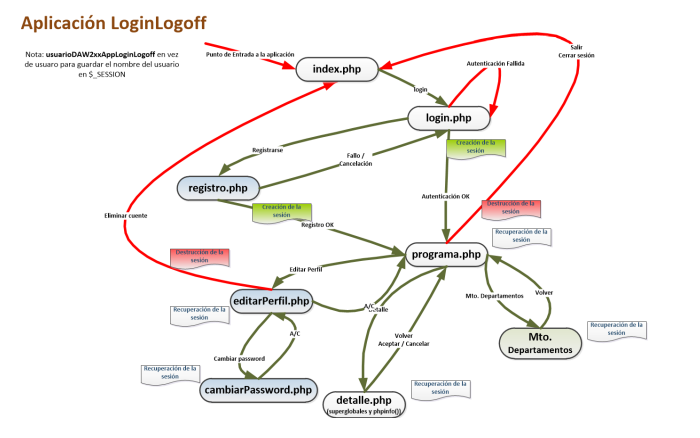

# LoginLogoffTema5

## Asignatura: Desarrollo Web en Entorno Servidor

- **Autor**: Víctor García Gordón
- **Fecha de Inicio del Proyecto**: 21/11/2024
- **Última Actualización**: 21/11/2024

---

## Descripción

Este proyecto forma parte del aprendizaje de la asignatura **Desarrollo Web en Entorno Servidor** y tiene como objetivo principal implementar un sistema de **autenticación de usuarios** y **control de acceso**. Se desarrolla mediante **PHP embebido en HTML** y utiliza una base de datos para la gestión de usuarios, perfiles y sesiones.

Incluye además el manejo de **cookies**, **sesiones** y una implementación básica de **seguridad y navegación estructurada**.

---

## Funcionalidades

- **Autenticación de usuarios** mediante formulario (Login.php).
- **Control de acceso** utilizando variables de sesión (`$_SESSION`) y cookies (`$_COOKIE`).
- Gestión de usuarios con diferentes **perfiles**:
  - **Administrador**: Acceso completo a todas las funcionalidades.
  - **Usuario**: Acceso restringido a consultas y búsqueda.
- Registro y manejo de:
  - **Fecha y hora del último acceso** con cookies persistentes.
  - Identificación de si es el **primer acceso** del usuario.
- **Funcionalidad de Logoff**:
  - Finalización de la sesión activa.
  - Redirección al formulario de autenticación.
- **Navegación estructurada** entre Login.php y Programa.php.
- Configuración y uso de **Xdebug** para depuración en entornos de desarrollo.
- Manejo avanzado de cookies y sesiones:
  - Relación entre `PHPSESSID` y la cookie del cliente.
  - Configuración de **tiempos de vida**, inicialización y destrucción.

---

## Tecnologías y Herramientas

### Frontend

- **HTML**
- **CSS**

### Backend

- **PHP**
- **MySQL** (con extensiones PDO)

### Herramientas de Desarrollo

- **Xdebug**: Depuración integrada.
- **Servidor Apache**: Implementado en Ubuntu Server.
- **NetBeans**: IDE configurado para desarrollo PHP.

---

## Requisitos Previos

1. **Entorno de Desarrollo Configurado**:
   - PHP y MySQL instalados en tu sistema.
   - Xdebug configurado para la depuración.
2. **Base de Datos**:
   - Base de datos `DB2XXDWESLoginLogoff` creada con los scripts proporcionados:
     - `CreaDBDB2XXDWESLoginLogoff.sql`: Script para la creación de la base de datos.
     - `CargaInicialDBDB2XXDWESLoginLogoff.sql`: Script para cargar datos iniciales.
     - `BorraDBDB2XXDWESLoginLogoff.sql`: Script para eliminar la base de datos.
3. **Configuración PHP**:
   - Habilitar el uso de sesiones y cookies en `php.ini`.

---

## Entornos

### Entorno de Desarrollo (Local)

- URL: [http://daw202.isauces.local/202DWESLoginLogoffTema5/indexProyectoLoginLogoffTema5.php](http://daw202.isauces.local/202DWESLoginLogoffTema5/indexProyectoLoginLogoffTema5.php)

### Entorno de Explotación

---

## Notas

- Este proyecto está en desarrollo y puede haber actualizaciones o mejoras futuras.